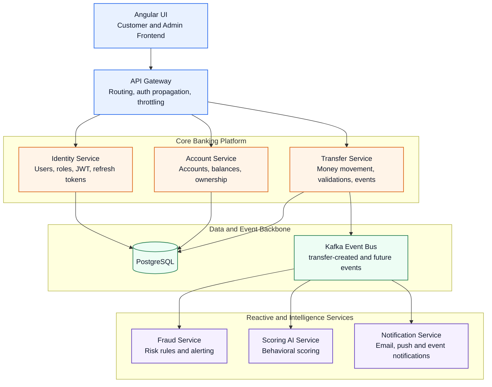

# YeriBank - Event-Driven Digital Banking Core

Proyecto fintech orientado a demostrar arquitectura y criterios senior con foco en:

- Arquitectura Hexagonal
- SOLID aplicado en casos de uso
- Spring Security con JWT y RBAC
- PostgreSQL + Flyway
- Kafka event-driven
- Swagger/OpenAPI
- Docker + Docker Compose
- Angular frontend enterprise-ready
- CI/CD gratuito

## Estado actual

Base inicial creada:

- Esqueleto backend Spring Boot (`backend/`) con capas `domain`, `application`, `infrastructure`, `config`
- Módulo Auth implementado: JWT access token + refresh token rotativo + roles `ADMIN` / `USER`
- Módulo de cuentas implementado con control de acceso por propietario y `ADMIN`
- Módulo de transferencias implementado con transacción ACID, locking optimista y evento Kafka `TransferCreatedEvent`
- Endpoints activos: `/auth/login`, `/auth/refresh`, `/users`, `/accounts`, `/accounts/{id}/balance`, `/transfers`
- OpenAPI activo
- Migraciones Flyway (`V1`, `V2`) para usuarios, cuentas, transferencias y refresh tokens
- `docker-compose.yml` con `app`, `postgres`, `kafka`, `zookeeper`

## Arquitectura objetivo



En Fase 1 se implementa como monolito modular hexagonal. En Fase 2 se extraen microservicios.

## Estructura

```text
backend/
  src/main/java/com/yeribank/core/
    domain/
    application/
    infrastructure/
    config/
  src/main/resources/
    db/migration/
docs/
frontend/
```

## Documentacion publica

La documentacion del proyecto tambien puede publicarse como sitio estatico con GitHub Pages.

- Fuente: `docs/`
- Configuracion del sitio: `mkdocs.yml`
- Workflow de despliegue: `.github/workflows/docs-pages.yml`

La documentacion publica separa:

- estado implementado real
- vision y roadmap del producto

## Ejecutar local con Docker

```bash
docker compose up --build
```

- App: `http://localhost:8080`
- Swagger: `http://localhost:8080/swagger-ui.html`
- PostgreSQL: `localhost:5432`
- Kafka: `localhost:9092`

## Despliegue cloud recomendado

Primera version cloud recomendada:

- API en Render
- PostgreSQL en Neon
- Kafka desactivado en cloud con `APP_KAFKA_ENABLED=false`

Guia: [docs/deployment-cloud.md](docs/deployment-cloud.md)

## Endpoints de autenticacion

1. `POST /users`
- Crea usuario.
- Primer usuario puede crearse con rol `ADMIN` (bootstrap).
- Luego, solo `ADMIN` autenticado puede crear usuarios `ADMIN`.

2. `POST /auth/login`
- Recibe `email` + `password`.
- Devuelve `accessToken` (JWT) y `refreshToken`.

3. `POST /auth/refresh`
- Recibe `refreshToken`.
- Revoca el token anterior y devuelve un nuevo par `accessToken` + `refreshToken`.

## Endpoints bancarios

1. `POST /accounts`
- Requiere JWT.
- Crea una cuenta para el usuario autenticado.
- Si el caller es `ADMIN`, puede crear cuentas para otro usuario enviando `userId`.

2. `GET /accounts/{id}/balance`
- Requiere JWT.
- El propietario de la cuenta puede consultar su saldo.
- `ADMIN` puede consultar cualquier cuenta.

3. `POST /transfers`
- Requiere JWT.
- Ejecuta una transferencia entre dos cuentas.
- Valida saldo, evita transferencias a la misma cuenta y publica un evento Kafka al confirmar.

## Proximos entregables (Fase 1)

1. Consumidores internos (fraude, scoring, notificaciones)
2. Manejo global de auditoria + logs estructurados
3. Tests de dominio/aplicacion + pruebas de integracion
4. API Gateway y separacion progresiva por bounded context

## Fase 2 (microservicios)

- Separacion por bounded context
- API Gateway dedicado
- Saga de transferencia con compensaciones
- Despliegue opcional en Kubernetes

Ver detalle en [docs/architecture.md](docs/architecture.md).
