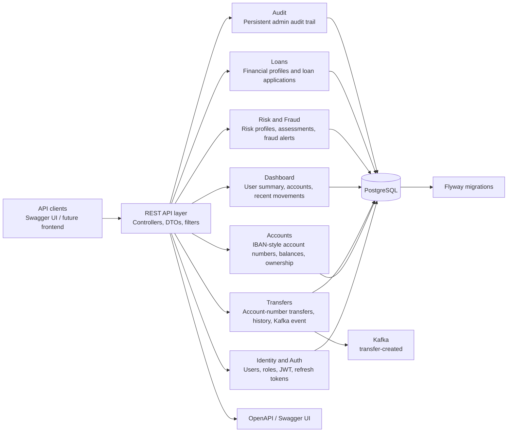
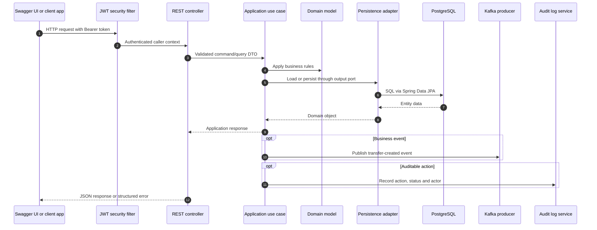
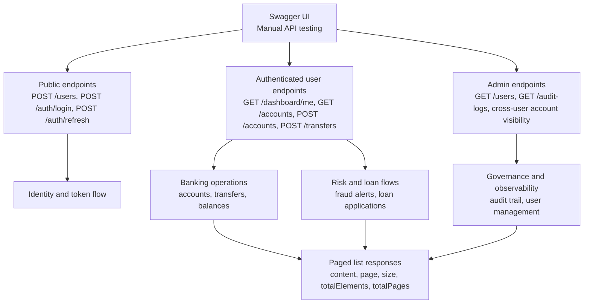
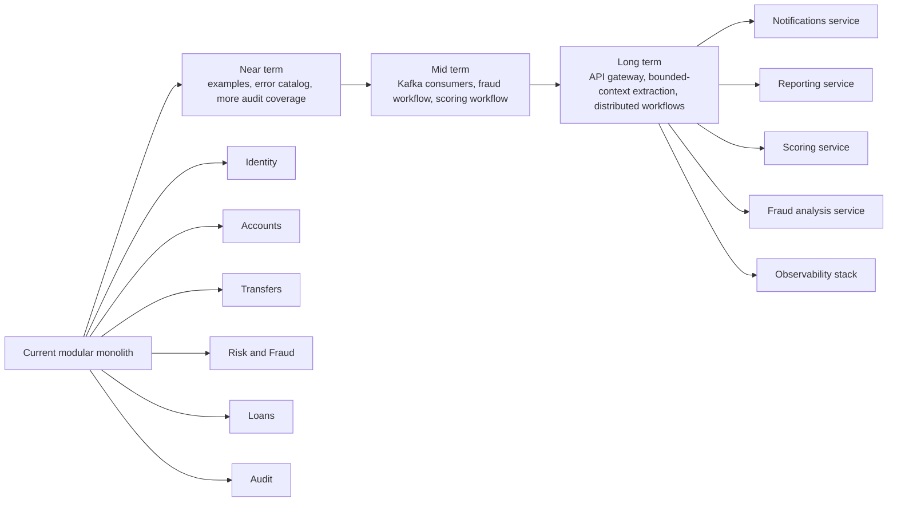

# Backend Diagrams

This page explains the current YeriBank backend visually and shows the intended evolution path.

## Current Backend Modules

## Runtime Request Flow

## Data Relationships

## API Surface by Consumer

## Evolution Map

## Reading the Diagrams

The first diagram is the current backend map. The second shows how one request moves through security, controllers, use cases, domain logic and adapters. The third focuses on persistence relationships. The fourth and fifth diagrams show how the API is consumed today and how the project can grow without losing the existing modular boundaries.
