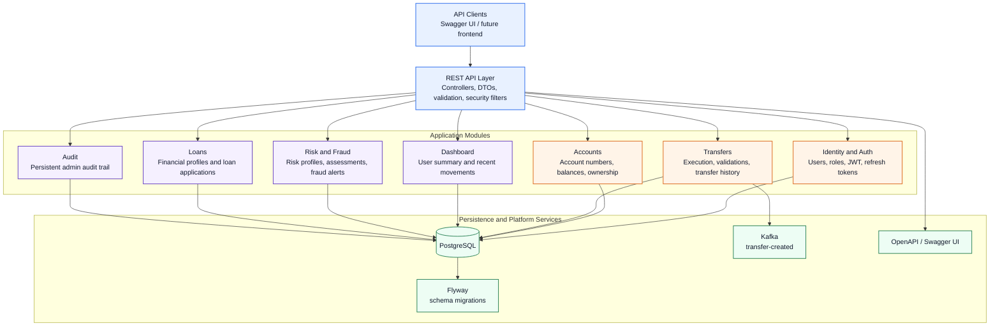
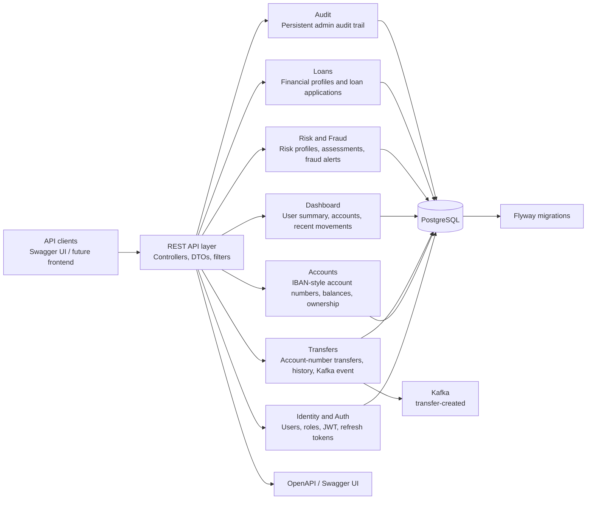
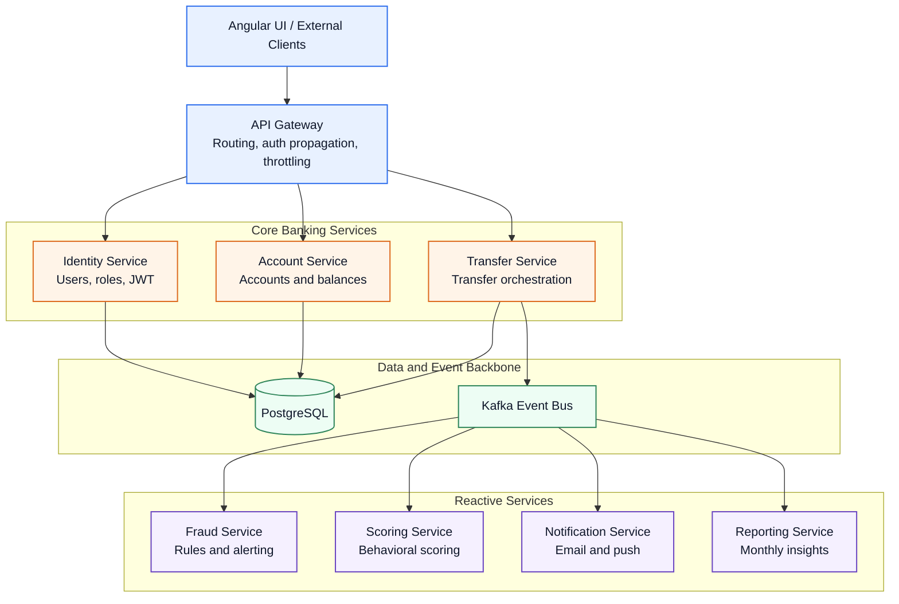
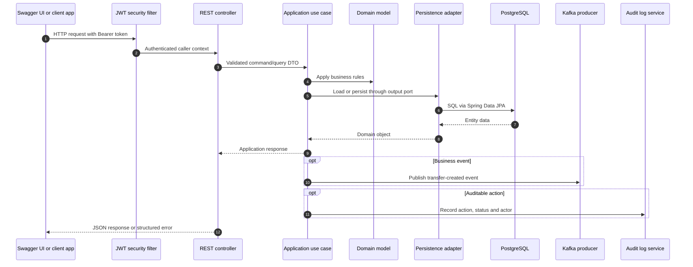
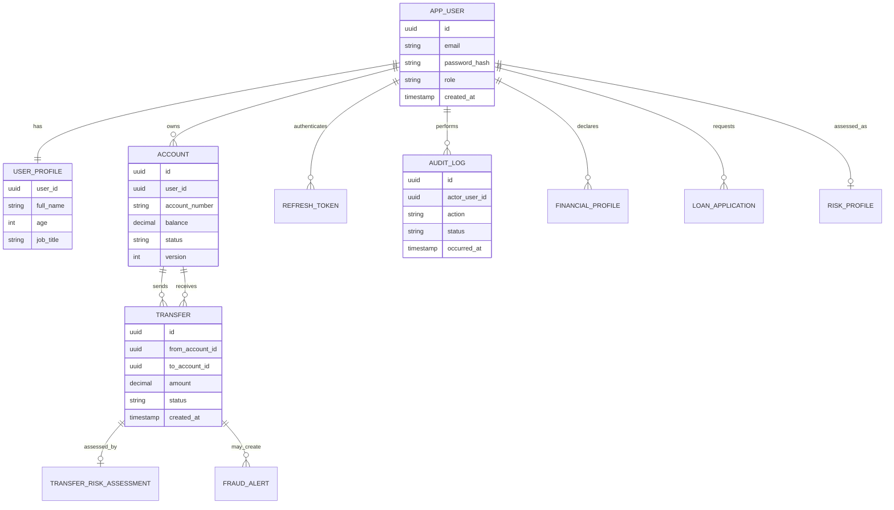
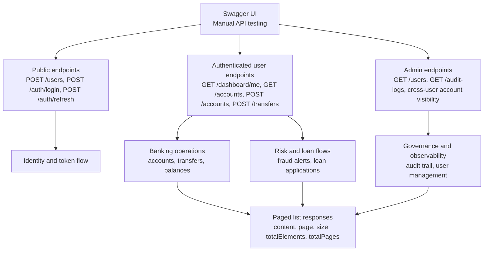
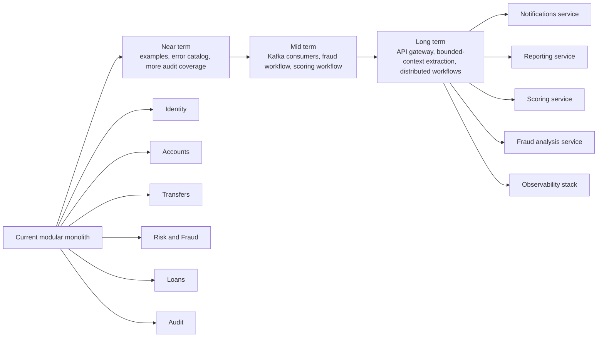

# Backend Diagrams

This page explains the current YeriBank backend visually and shows the intended evolution path.

## Current Backend Map

## Current Hexagonal View

## Target Microservice View

## Runtime Request Flow

## Data Relationships

## API Surface by Consumer

## Evolution Map

## Reading the Diagrams

The first diagram is the current backend map. The second shows the same platform from a more explicitly hexagonal perspective. The third presents the target microservice-oriented shape. The remaining diagrams explain runtime flow, data relationships, API surface and the evolution path without losing the current modular boundaries.
